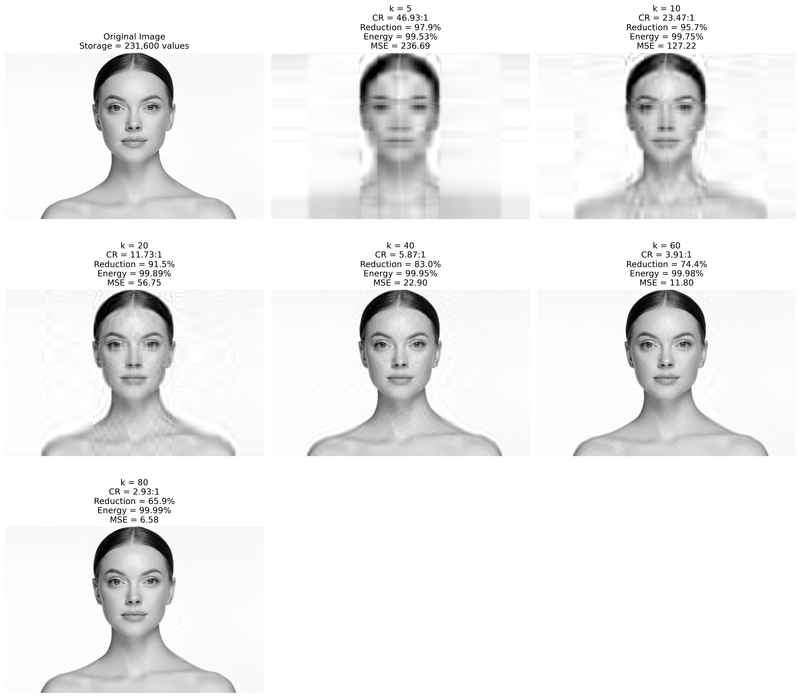
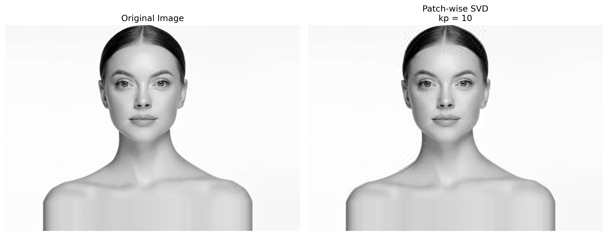

# Low-Rank Image Analysis using Singular Value Decomposition (SVD) 

This project investigates image compression using Singular Value Decomposition (SVD). The study compares global and patch-wise low-rank approximations and examines how compression ratio, reconstruction error, and energy retention change as singular values are discarded.

## Overview

This project investigates the use of Singular Value Decomposition (SVD) for image compression and low-rank image reconstruction.

Two approaches are implemented and compared:

* Global SVD Compression
* Patch-wise SVD Compression

Performance is evaluated using:

* Compression Ratio
* Storage Reduction
* Energy Retention
* Mean Squared Error (MSE)

## Mathematical Background

An image matrix A can be decomposed using Singular Value Decomposition:

A = UΣVᵀ

where:

* U contains left singular vectors
* Σ contains singular values
* Vᵀ contains right singular vectors

By retaining only the dominant singular values, a low-rank approximation of the image can be obtained while preserving most of the information content.

## Methodology

### Global SVD Compression

1. Convert image to grayscale.
2. Compute Singular Value Decomposition.
3. Retain the first k singular values.
4. Reconstruct the image.
5. Evaluate compression and reconstruction quality.

### Patch-wise SVD Compression

1. Divide the image into 64×64 patches.
2. Compute SVD independently for each patch.
3. Retain the first kp singular values for each patch.
4. Reconstruct individual patches.
5. Reassemble the image.

Image padding was used to ensure complete patch coverage and eliminate boundary artifacts.

## Results

| Method         | Rank | Compression Ratio | Storage Reduction | MSE   | Energy Retention |
| -------------- | ---- | ----------------- | ----------------- | ----- | ---------------- |
| Global SVD     | 60   | 3.91              | 74.40%            | 11.80 | 99.98%           |
| Patch-wise SVD | 10   | 3.18              | 68.51%            | 11.43 | 99.9773%         |

## Visual Results

### Global SVD Compression

### Patch-wise SVD Reconstruction

## Key Findings

* Global SVD achieved a compression ratio of 3.91 while retaining 99.98% of image energy.
* Patch-wise SVD achieved comparable reconstruction quality using only 10 singular values per patch.
* Reconstruction errors for the two approaches were similar (MSE ≈ 11–12).
* Padding image boundaries eliminated reconstruction artifacts caused by incomplete patches.
* Patch-wise SVD achieved reconstruction quality comparable to global SVD at rank 10 (versus rank 60 globally), indicating that local   image regions possess stronger low-rank structure and can be represented efficiently using fewer singular values.
  
## Limitations

* Results are based on a single grayscale image.
* Patch-wise analysis was performed for kp = 10.
* Only one patch size (64×64) was investigated.

## Future Work

* Multi-image benchmarking
* Patch-size sensitivity analysis
* SVD-based image denoising
* Audio compression using SVD
* Video compression using SVD
* Tensor decomposition methods

## Technologies Used

* Python
* NumPy
* Matplotlib
* Pillow (PIL)
